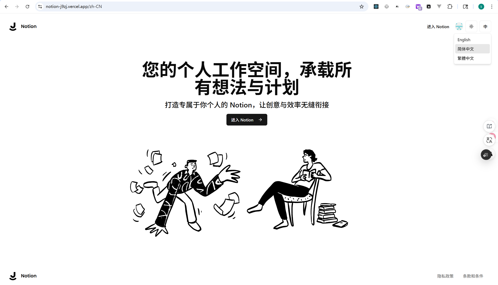
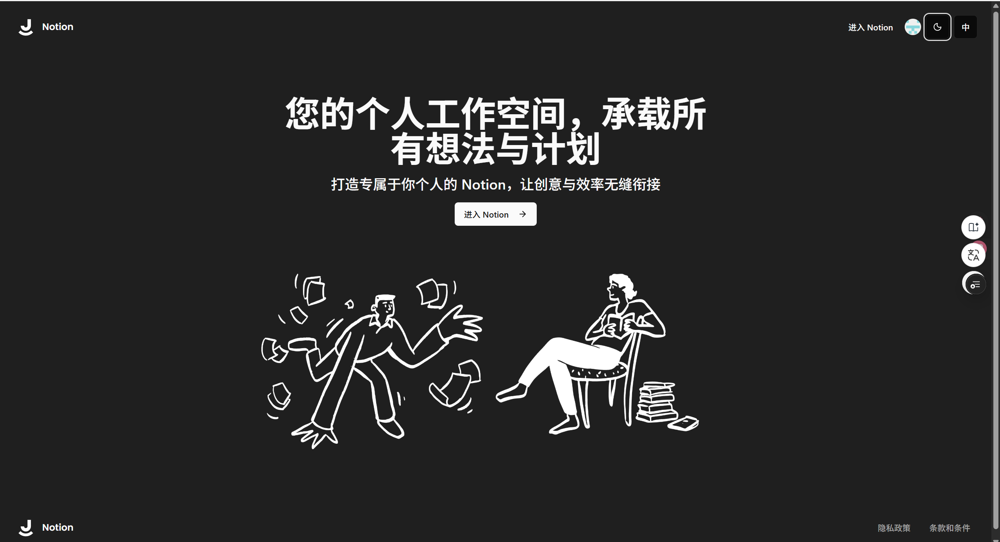
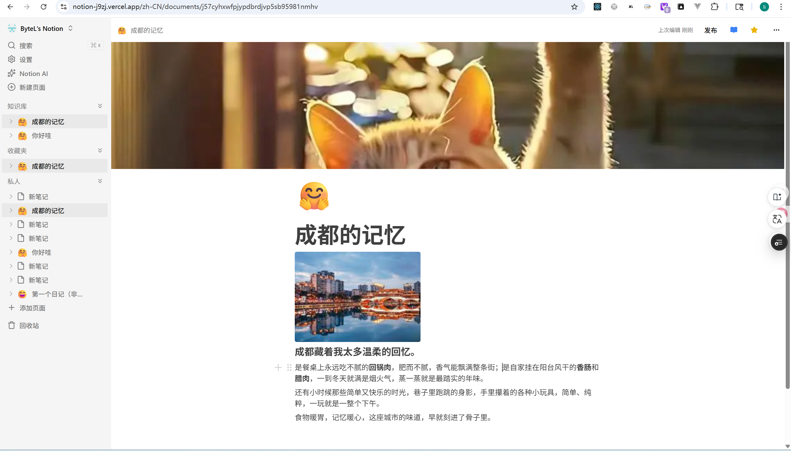
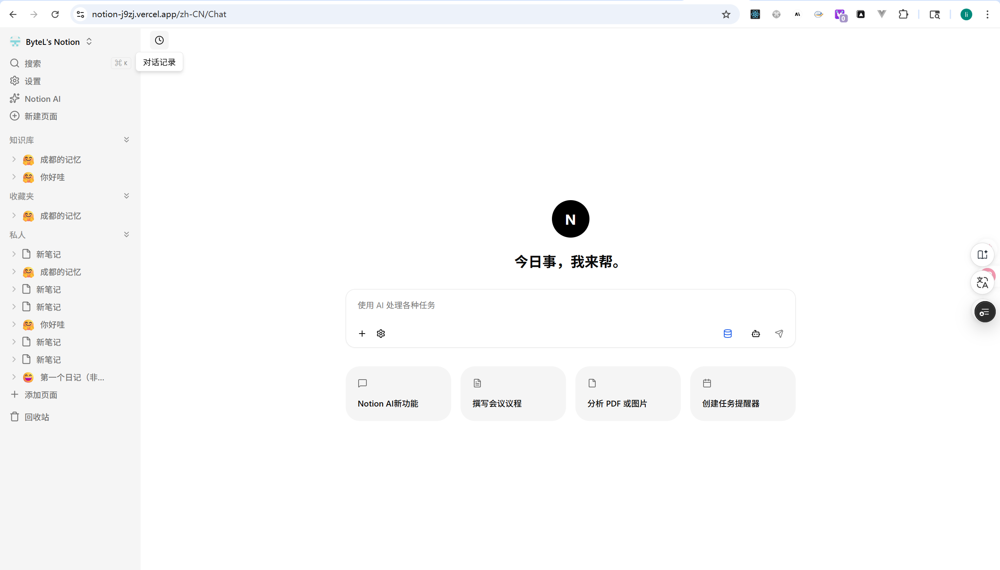
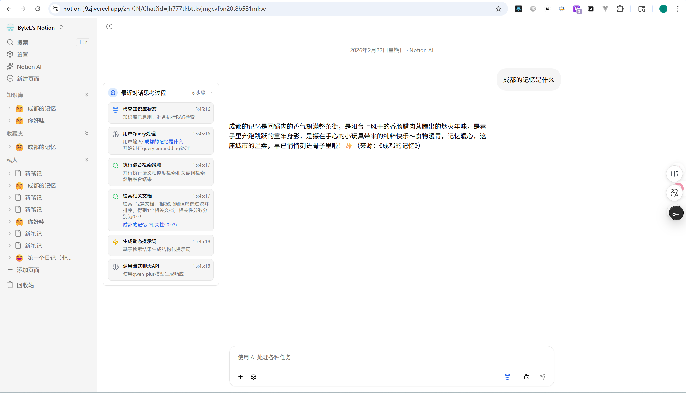
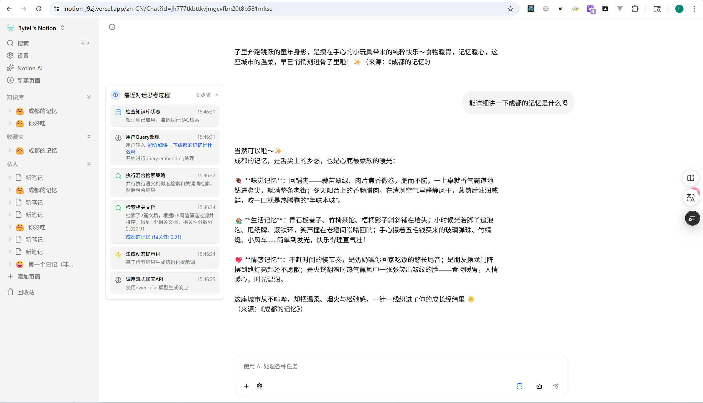

# My-Notion


基于现代前端与 AI 技术栈构建的个性化 Notion 应用，提供类似 Notion 的文档编辑和管理功能。核心特点包括富文本编辑、主题色切换、用户认证、实时数据同步、AI智能对话、响应式设计、多语言国际化等。

## 📸 项目截图

### 首页（亮色主题）



### 首页（暗黑主题）



### 文档编辑页面



### AI 聊天页面



### AI 思考过程可视化




## 功能特性

- 📝 **富文本编辑器**：基于 BlockNote 的强大编辑器，支持多种内容格式
- 🔐 **用户认证**：使用 Clerk 实现安全的用户登录和注册
- 🗄️ **数据存储**：使用 Convex 作为后端数据库，提供实时数据同步
- 🤖 **AI 智能对话**：基于 RAG 技术的智能对话功能，利用用户文档作为知识库，提供精准的文档问答服务
  - **已实现**：基于余弦相似度的向量检索 + 关键词检索的混合检索策略，动态提示词配置，AI思考过程可视化，用户隔离的持久化对话历史记录，流式响应体验，RAG动态增量更新
  - **未来规划**：更高级的检索优化、多模态文档支持
- 🎨 **响应式设计**：适配不同屏幕尺寸的现代 UI
- 🌙 **主题色切换**：支持亮色和深色主题切换
- 🌐 **全栈国际化架构**：Next.js 服务端渲染 + Clerk 鉴权认证 + Convex 实时数据 + Tailwind CSS + Shadcn 响应式设计，集成 next-intl 实现多语言支持（中、英、繁体已上线）
- 🔍 **文档搜索**：快速搜索和定位文档
- 📁 **文档管理**：支持文档的创建、编辑、归档和删除
- ⭐ **收藏功能**：支持收藏重要文档，方便快速访问

## 技术栈

### 前端

- **Next.js** 16 - 现代化 React 框架
- **React** 19 - 用户界面库
- **TypeScript** - 类型安全的 JavaScript
- **Tailwind CSS** - 实用优先的 CSS 框架
- **BlockNote** - 富文本编辑器
- **Shadcn UI** - 基于 Radix UI 的可访问性组件库
- **Clerk** - 用户认证和管理
- **Sonner** - 优雅的通知系统

### 后端

- **Convex** - 实时后端数据库
- **Edge Store** - 边缘存储服务

### AI/大语言模型

- **LangChain** - AI 应用开发框架
- **通义千问** - 大语言模型

## 快速开始

### 前提条件

- Node.js 22.0 或更高版本
- pnpm 包管理器
- Convex 账号
- Clerk 账号
- Edge Store 账号

### 安装步骤

1. **克隆仓库**

   ```bash
   git clone https://github.com/HaveNiceDa/Notion.git
   cd notion
   ```

2. **安装依赖**

   ```bash
   pnpm i
   ```

3. **配置环境变量**

   创建 `.env.local` 文件并添加以下环境变量：

   ```env
   # Convex
   CONVEX_DEPLOYMENT=your-convex-deployment
   NEXT_PUBLIC_CONVEX_URL=your-convex-url

   # Clerk
   NEXT_PUBLIC_CLERK_PUBLISHABLE_KEY=your-clerk-publishable-key
   CLERK_SECRET_KEY=your-clerk-secret-key
   CLERK_JWT_ISSUER_DOMAIN=your-clerk-jwt-issuer-domain

   # Edge Store
   EDGE_STORE_ACCESS_KEY=your-edge-store-access-key
   EDGE_STORE_SECRET_KEY=your-edge-store-secret-key

   # LLM (可选)
   LLM_API_KEY=your-llm-api-key
   ```

4. **启动开发服务器**

   ```bash
   # 启动 Convex 开发服务器（新终端）
   npx convex dev

   # 启动 Next.js 开发服务器
   pnpm run dev
   ```

   应用将在 `http://localhost:3000` 运行。

## 环境变量配置

### Convex

- `CONVEX_DEPLOYMENT` - Convex 部署 ID
- `NEXT_PUBLIC_CONVEX_URL` - Convex 应用 URL

### Clerk

- `NEXT_PUBLIC_CLERK_PUBLISHABLE_KEY` - Clerk 可发布密钥
- `CLERK_SECRET_KEY` - Clerk 密钥
- `CLERK_JWT_ISSUER_DOMAIN` - Clerk JWT 颁发者域

### Edge Store

- `EDGE_STORE_ACCESS_KEY` - Edge Store 访问密钥
- `EDGE_STORE_SECRET_KEY` - Edge Store 密钥

### LLM (可选)

- `LLM_API_KEY` - 通义千问 API 密钥

## 项目结构

```
notion/
├── src/                          # 源代码目录
│   ├── app/                      # Next.js 应用路由
│   │   ├── [locale]/             # 国际化路由
│   │   │   ├── (main)/           # 主应用布局
│   │   │   │   ├── (AI)/         # AI 功能模块
│   │   │   │   │   └── Chat/     # 聊天功能
│   │   │   │   ├── (routes)/     # 主路由页面
│   │   │   │   │   └── documents/ # 文档管理
│   │   │   │   └── _components/  # 主应用通用组件
│   │   │   ├── (marketing)/      # 营销页面
│   │   │   ├── (public)/         # 公共页面
│   │   │   ├── demo/             # BlockNote 演示页面
│   │   │   └── monitoring/       # 监控路由
│   │   └── api/                   # API 路由
│   │       ├── chat/             # 聊天 API
│   │       ├── edgestore/        # 边缘存储 API
│   │       ├── embeddings/       # 嵌入 API
│   │       └── rag/              # RAG API
│   ├── components/                # 可复用组件
│   │   ├── modals/                # 模态框组件
│   │   ├── providers/             # 上下文提供者
│   │   ├── ui/                    # UI 组件库
│   │   └── Editor.tsx            # 编辑器组件（示例）
│   ├── config/                    # 配置文件
│   │   └── prompts/               # 提示词配置
│   ├── hooks/                     # 自定义 Hooks
│   ├── i18n/                      # 国际化相关
│   └── lib/                       # 工具函数库
│       ├── rag/                   # RAG 检索增强生成
│       ├── store/                 # 状态管理 Store
│       └── utils.ts               # 工具函数（示例）
├── convex/                        # Convex 后端
│   ├── _generated/                # 生成的代码
│   ├── aiChat.ts                  # AI 聊天功能
│   ├── documents.ts               # 文档管理
│   └── vectorStore.ts             # 向量存储
├── messages/                      # 国际化翻译文件
├── public/                        # 静态资源
└── README.md
```

## 部署指南

### Vercel 部署

1. **连接仓库**：在 Vercel 控制台中连接你的 GitHub 仓库

2. **配置环境变量**：在 Vercel 项目设置中添加所有必要的环境变量

3. **部署**：点击 "Deploy" 按钮开始部署

4. **配置域名**：（可选）添加自定义域名

### 其他部署平台

对于其他部署平台，请参考相应平台的文档，并确保正确配置环境变量。

## 注意事项

- **Clerk 配置**：确保在 Clerk 控制台中正确配置应用，特别是 JWT 颁发者域
- **Convex 部署**：运行 `npx convex dev` 确保 Convex 后端正确部署
- **Edge Store 配置**：确保 Edge Store 访问密钥和密钥正确配置
- **React 19/Next 16 严格模式**：BlockNote 目前尚不兼容 React 19 / Next 16 的 StrictMode 模式，请暂时禁用 StrictMode 模式

## 最近更新

- **RAG 动态增量更新机制**：成功实现了 RAG 知识库的动态增量更新功能，支持文档内容变更后自动更新向量索引，无需重建整个知识库，大幅提升了知识库更新效率
- **RAG 和 LLM 链路打通**：成功实现了基于 RAG（检索增强生成）技术的智能对话功能，将用户个人文档作为知识库，在向大语言模型提问前先经过 RAG 进行相关文档检索，提供更准确的回答
  - 实现了文档内容提取和文本分割功能
  - 集成了通义千问大语言模型进行对话生成
  - 使用自定义 Embeddings 和向量存储实现文档检索（当前采用余弦相似度匹配）
  - 支持流式响应，提供更好的用户体验
  - 实现了用户隔离的持久化对话历史记录，确保数据安全
  - 预留了多维度检索策略和动态提示词配置的扩展接口
- **支持查看文章创建和编辑时间**：在文档编辑页面添加了时间显示功能，可查看文章的创建时间和最后编辑时间，支持友好的时间格式显示（如"刚刚"、"X分钟前"、"X小时前"等）
- **支持目录文件移动到任意目录**：现在可以更灵活地组织文档结构，将目录文件移动到任何其他目录中
- **文章目录导航功能**：在文章左上角实现了目录导航，显示文件层级结构，支持跳转到上级目录
- **收藏功能**：新增文档收藏功能，支持一键收藏重要文档，在侧边栏收藏夹中快速访问，包含收藏夹空状态提示和多语言支持

## 近期支持 TODO

我们计划在近期版本中优先完成以下任务：

✅ **已完成：**

1. **RAG 功能优化**：完善 RAG 检索和生成的细节处理，提升回答质量和准确性
   - 多维度检索策略（关键词+向量混合检索）
   - 基于检索内容的动态提示词配置
2. **知识库管理功能**：支持新增和删除知识库的完整落库场景
3. **检索策略升级**：从单一余弦相似度检索升级为关键词搜索+向量检索的多维度混合检索策略
4. **动态提示词工程**：实现基于检索内容的智能动态提示词配置
5. **思考结果可视化**：展示 AI 思考过程和推理路径的可视化界面
6. **代码分割优化**：减少首屏加载时间，提升应用启动速度
7. **页面切换流畅性提升**：优化路由切换动画，减少页面加载时间
8. **更换文章标题图片时的骨架屏效果**：添加更美观的加载状态，提升用户体验
9. **编辑器性能优化**：优化 BlockNote 编辑器的渲染性能，支持更大文档
10. **响应式设计改进**：进一步优化移动设备上的用户体验
11. **错误处理增强**：添加更友好的错误提示和恢复机制
12. **修复文档拖拽 bug**：解决移动侧边栏文件到编辑区时 id 被带入编辑器的问题

🔄 **待完成：**

- **监控系统完善**：实现完整的日志记录和监控系统
- **多语言扩展**：支持更多语言翻译，如日语、韩语、法语等
- **文章内部搜索替换功能**：支持在文章内部快速搜索和替换文本
- **AI 总结文章内容**：利用 AI 技术自动总结文章的主要内容
- **多人协作功能**：支持多人实时协作编辑文档
- **文档侧边栏评论区**：在文档侧边栏添加评论功能
- **@人能力**：支持在编辑器和评论中@提及其他用户
- **更多主题**：提供更多美观的编辑器主题选择

## 未来支持计划

我们计划在未来版本中添加以下功能：

1. **Agent 功能**：开发智能 Agent，支持更复杂的任务自动化和多轮对话
2. **移动端应用**：使用 React Native 开发移动端 Notion 应用
   - 支持 iOS 和 Android 平台
   - 内嵌到原生应用中
   - 保持与 Web 端的数据同步
3. **日志监控系统**：实现完整的日志记录和监控系统
   - 针对页面或接口错误进行记录
   - 记录 AI 对话的检索过程
   - 集成 Sentry 进行错误追踪和监控
   - 后续形成日志看板可视化
4. **多语言扩展**：支持更多语言翻译，如日语、韩语、法语等
5. **文章内部搜索替换功能**：支持在文章内部快速搜索和替换文本
6. **AI 总结文章内容**：利用 AI 技术自动总结文章的主要内容
7. **更多编辑器功能**：添加更多富文本编辑功能，如表格、图表、数学公式等
8. **多人协作功能**：支持多人实时协作编辑文档（计划中）
9. **文档侧边栏评论区**：在文档侧边栏添加评论功能，支持对特定内容进行评论和讨论
10. **@人能力**：支持在编辑器和评论中@提及其他用户
11. **更多主题**：提供更多美观的编辑器主题选择

## 贡献

欢迎提交 Issue 和 Pull Request 来改进这个项目！

## 联系方式

如果有任何问题或建议，欢迎联系项目维护者。
